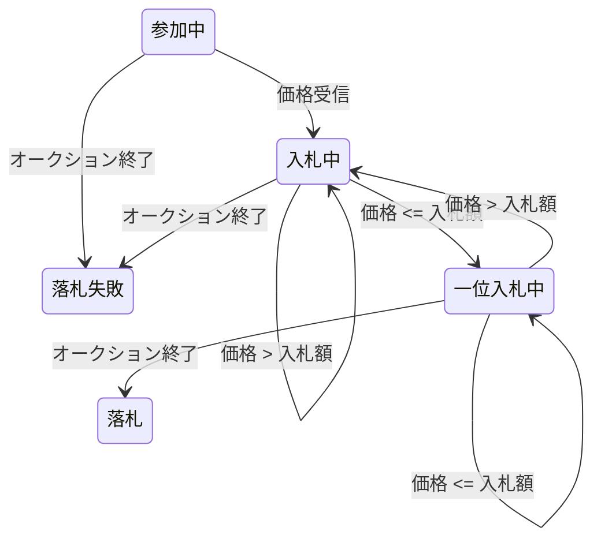

# 外部システム仕様

## オークションプロトコル

ステートマシンとして表現される入札者の振る舞いは以下の通り。
さしあたりは逆指値を無視する。



### コマンド

入札者とオークションハウスとの間でやり取りされるメッセージのプロトコルは、入札者がコマンドを送信する。  
コマンドは以下の通り。

- 参加
  - 入札者はオークションに参加する
  - XMPP メッセージの送り手が入札者として特定され、チャットセッションの名称によって商品が一意に定められる
- 入札
  - 入札者はオークションに入札価格を送信する

### イベント

オークションはイベントを送信する。

- 価格
  - オークションは、現在受理されている価格を報告する
  - このイベントには、次の入札で最低限増額するべき金額と、現在の価格を入札した入札者の名前が含まれる
  - 新しい入札者が参加した場合、オークションはこのイベントをその参加者に送信する
  - 新しい入札が受理されたときにはすべての入札者に送信する
- 終了
  - オークションは、終了したことを発表する
  - 最後の価格イベントの音を付けた入札者が、商品を落札する

## XMPP メッセージ

- XMPP メッセージに含まれているのはいくつかの名前と値だけで、キー／値のペアの形で一行にまとめられている
- 各行は、プロトコル自体のバージョン番号から始まる
- 販売する商品を識別するのにログイン名を使っている
- ID12793 の商品に入札するためには、クライアントはサザベーサーバーが「オークション-12793」という「ユーザー」とチャットを開始することになる
- サーバーに誰が入札しているかという情報を呼び出し元の識別子から見分けられる
  - アカウントがすでに設定されていることが前提

```
SOLVersion: 1.1; Command: JOIN;
SOLVersion: 1.1; EVENT: PRICE; CurrentPrice: 192; Increment: 7; Bidder: Someone else;
SOLVersion: 1.1; Command: BID; Price: 199;
SOLVersion: 1.1; Event: CLOSE;
```
